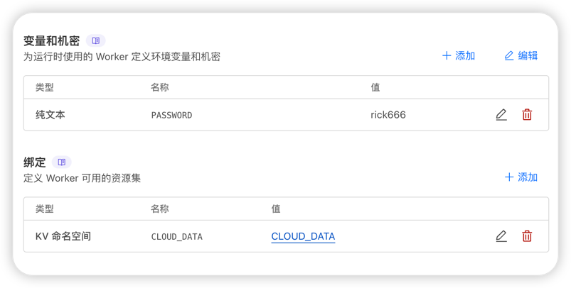

# Cloudflare Workers 单独部署后端教程

### 1. 复制后端代码

```javascript
addEventListener('fetch', event => {
  event.respondWith(handleRequest(event.request));
});

async function handleRequest(request) {
  const url = new URL(request.url);
  const pathname = url.pathname;

  // 设置 CORS 头
  const corsHeaders = {
    'Access-Control-Allow-Origin': '*',
    'Access-Control-Allow-Headers': 'Authorization, Content-Type',
    'Access-Control-Allow-Methods': 'GET, POST, OPTIONS',
  };

  if (request.method === 'OPTIONS') {
    // 处理预检请求
    return new Response(null, {
      status: 204,
      headers: corsHeaders,
    });
  }

  const PASSWORD = PASSWORD; // 从环境变量中获取密码

  if (pathname === '/api/auth' && request.method === 'POST') {
    // 身份验证
    const { password } = await request.json();
    if (password === PASSWORD) {
      return new Response(JSON.stringify({ message: 'Authenticated' }), {
        headers: { 'Content-Type': 'application/json', ...corsHeaders },
      });
    } else {
      return new Response(JSON.stringify({ message: 'Unauthorized' }), {
        status: 401,
        headers: { 'Content-Type': 'application/json', ...corsHeaders },
      });
    }
  } else if (pathname === '/api' && (request.method === 'GET' || request.method === 'POST')) {
    // 验证 Authorization 头
    const authHeader = request.headers.get('Authorization');
    if (!authHeader || authHeader !== `Bearer ${PASSWORD}`) {
      return new Response(JSON.stringify({ message: 'Unauthorized' }), {
        status: 401,
        headers: { 'Content-Type': 'application/json', ...corsHeaders },
      });
    }

    if (request.method === 'GET') {
      // 从 KV 获取数据
      const data = await DATA.get('data');
      return new Response(data || '[]', {
        headers: { 'Content-Type': 'application/json', ...corsHeaders },
      });
    } else if (request.method === 'POST') {
      // 将数据保存到 KV
      const body = await request.text();
      await DATA.put('data', body);
      return new Response(JSON.stringify({ message: 'Data saved successfully' }), {
        headers: { 'Content-Type': 'application/json', ...corsHeaders },
      });
    }
  }

  return new Response(JSON.stringify({ message: 'Not Found' }), {
    status: 404,
    headers: { 'Content-Type': 'application/json', ...corsHeaders },
  });
}
```


### 2. 配置 KV 存储 与 PASSWORD

 **创建 KV 命名空间**

- 登录到 Cloudflare 仪表板，进入您的账户。

- 在左侧导航栏中，点击 **“Workers”**，然后选择 **“KV”**。

- 点击 **“Create Namespace”**，创建一个新的 KV 命名空间。

  - **Namespace**：输入命名空间名称，例如 `my-kv-store`。

- 创建后，记下命名空间的 **ID**（在列表中可以看到）。

 **创建变量**  PASSWORD



### 3.在页面直接填入worker的 url  不需要/api
